# Multi-Modal Note-Taking Assistant

An end-to-end lecture-video processing pipeline that combines computer vision, optical character recognition, speech recognition, and natural-language processing to generate structured, concise notes from recorded lectures.

## Overview

Students often need to follow spoken explanations, read visual material, and organize notes at the same time. This project automates that workflow by extracting useful information from both the visual and audio streams of a lecture video and combining them into readable notes.

The system processes a lecture through five stages:

1. Extract and classify video frames.
2. Recover structured text from relevant slides.
3. Detect and transcribe meaningful speech.
4. Select important information with extractive summarization.
5. Generate concise, fluent notes with abstractive summarization.

## Key Features

- Extracts lecture-video frames at one frame per second.
- Classifies frames as `slide`, `presenter_slide`, or `other` using a fine-tuned ResNet-34 model.
- Crops slide content from presenter-visible frames using feature matching and perspective transformation.
- Removes visually redundant frames through feature-based clustering.
- Extracts text with Tesseract OCR.
- Corrects OCR errors with SymSpell.
- Preserves slide hierarchy by identifying titles, emphasized text, body text, and footers.
- Uses Voice Activity Detection and Noise Activity Detection to isolate useful speech segments.
- Supports speech transcription through DeepSpeech and Vosk.
- Applies TF-IDF filtering and TextRank for extractive summarization.
- Uses a fine-tuned BART model for abstractive summarization.
- Evaluates generated summaries with ROUGE metrics.

## System Pipeline

```mermaid
flowchart LR
    A[Lecture Video] --> B[Frame Extraction]
    A --> C[Audio Extraction]

    B --> D[ResNet-34 Frame Classification]
    D --> E[Perspective Cropping]
    E --> F[Duplicate Frame Removal]
    F --> G[Tesseract OCR]
    G --> H[Spelling Correction]
    H --> I[Slide Structure Analysis]

    C --> J[VAD and NAD]
    J --> K[Speech Chunking]
    K --> L[DeepSpeech or Vosk]
    L --> M[Speech Transcript]

    I --> N[Time-Aligned Text]
    M --> N
    N --> O[TF-IDF Filtering]
    O --> P[TextRank]
    P --> Q[Fine-Tuned BART]
    Q --> R[Structured Lecture Notes]
```



## Pipeline Details

### Stage 1: Frame Extraction and Classification

The visual pipeline samples one frame per second and classifies each frame into one of three categories:

- `slide` — full-screen slide content
- `presenter_slide` — the presenter and slide are both visible
- `other` — frames without useful slide content

A ResNet-34 model initialized with ImageNet weights is fine-tuned for the three-class task. Hyperparameters were selected using Optuna.

Frames classified as `presenter_slide` are processed to isolate the slide region. The primary method uses ORB feature detection, FLANN matching, a RANSAC-based homography, and perspective transformation. Hough-line detection and KMeans-based corner estimation provide a fallback when feature matching is unreliable.

Near-duplicate slide frames are removed by comparing ResNet feature representations with cosine similarity.

### Stage 2: OCR and Slide Structure Analysis

Relevant slide images are converted into structured text through:

1. **Tesseract OCR** for word- and line-level text extraction.
2. **SymSpell** for spelling correction.
3. **Slide Structure Analysis** for identifying:
   - titles
   - emphasized or bold text
   - normal body text
   - footers

The resulting structured transcript preserves both the slide content and its visual hierarchy.

### Stage 3: Audio Processing and Speech Recognition

The audio pipeline uses:

- **Voice Activity Detection (VAD)** to identify speech.
- **Noise Activity Detection (NAD)** to distinguish background noise from silence.
- Speech-aware chunking to create manageable transcription segments.
- **DeepSpeech** or **Vosk** for automatic speech recognition.

This preprocessing reduces unnecessary computation and improves the quality of the transcript supplied to the summarization stages.

### Stage 4: Extractive Summarization

The extractive pipeline first computes sentence-level TF-IDF scores and retains the most informative content. TextRank then represents sentences as a graph and ranks them according to their semantic relationships.

Selected sentences are restored to their original lecture order to preserve readability and context.

### Stage 5: Abstractive Summarization

The extractive output is passed to a fine-tuned `facebook/bart-large` model. BART rewrites and compresses the selected content to produce more natural, concise, and coherent notes.

The model was fine-tuned on the CNN/DailyMail summarization dataset.

## Reported Results

| Component | Metric | Reported Result |
|---|---:|---:|
| ResNet-34 frame classifier | Overall accuracy | 0.91 |
| ResNet-34 frame classifier | Macro F1-score | 0.89 |
| BART summarization | ROUGE-1 | 41.1 |
| BART summarization | ROUGE-2 | 18.3 |
| BART summarization | ROUGE-L | 38.2 |

The project’s error analysis also showed that transcription quality strongly affects the final summary: inaccurate ASR output can cause semantic drift, while cleaner transcripts produce more faithful summaries.

## Repository Structure

```text
multi-model-note-assistant/
├── stage1/       # Frame extraction, classification, cropping, and clustering
├── stage2/       # OCR, spelling correction, and slide structure analysis
├── stage3/       # Audio preprocessing, chunking, and speech recognition
├── stage4_5/     # Extractive and abstractive summarization
├── examples/     # Evaluation notebooks, plots, and sample outputs
├── LICENSE
└── README.md
```

## Getting Started

### 1. Clone the Repository

```bash
git clone https://github.com/akshat240401/multi-model-note-assistant.git
cd multi-model-note-assistant
```

### 2. Create a Python Environment

#### Windows PowerShell

```powershell
python -m venv .venv
.\.venv\Scripts\Activate.ps1
```

#### macOS or Linux

```bash
python3 -m venv .venv
source .venv/bin/activate
```

### 3. Install Required Tools and Models

The pipeline uses several external tools and pretrained models. Depending on the stage being executed, you may need:

- Python 3
- FFmpeg
- Tesseract OCR
- PyTorch and torchvision
- OpenCV
- scikit-learn
- Optuna
- SymSpell
- WebRTC VAD
- DeepSpeech or Vosk models
- Hugging Face Transformers
- BART model weights
- ROUGE evaluation tools

Install the dependencies required by the relevant stage-specific scripts or notebooks. Large datasets and model weights may need to be downloaded separately.

## Running the Pipeline

Run the stages in order:

| Stage | Input | Output |
|---|---|---|
| Stage 1 | Lecture video | Filtered, cropped, non-duplicate slide images |
| Stage 2 | Slide images | Structured OCR transcript |
| Stage 3 | Lecture audio | Speech transcript |
| Stage 4 | OCR and speech text | Extractive summary |
| Stage 5 | Extractive summary | Final abstractive notes |

Refer to the scripts and notebooks inside each stage directory for the corresponding entry points, model paths, and data configuration.

## Limitations

- ASR errors can propagate into the final abstractive summary.
- OCR quality depends on slide resolution, contrast, font style, and camera angle.
- Perspective correction can be affected by occlusion or weak visual features.
- Large models such as BART may require substantial memory and benefit from GPU acceleration.
- The current pipeline processes the visual and audio modalities separately before combining their text outputs.
- An experimental direct image-text embedding fusion approach was explored but was not included in the final pipeline.

## Future Work

Potential improvements include:

- Replacing legacy ASR components with stronger modern speech-recognition models.
- Adding confidence-aware fusion between OCR and speech transcripts.
- Aligning notes with lecture timestamps.
- Supporting diagrams, equations, tables, and handwritten content.
- Building an interactive interface for video upload, note review, and export.
- Using multimodal transformer models for direct visual-text summarization.
- Adding automated tests and reproducible stage-level configuration.

## Team

This project was developed collaboratively by:

- **Akshat Mehta**
- **Bhavdeep Khileri**
- **Rohan Rasane**

This repository is maintained on Akshat Mehta’s GitHub profile to document the project and its development history. The original commit history is preserved so that each contributor’s work remains properly attributed.

## Academic Context

The project was completed through the Department of Computer Science at the Rochester Institute of Technology. The accompanying final report contains the full methodology, model architecture, experiments, benchmarks, examples, and error analysis.

## License

This project is distributed under the **GNU Affero General Public License v3.0**. See the [`LICENSE`](LICENSE) file for details.
